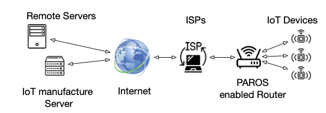

# PAROS: The Missing ``Puzzle'' in Smart Home Router Operating Systems

The Internet of Things (IoT) devices have been increasingly deployed in smart homes for automation. Unfortunately, extensive recent research shows that external on-path adversaries can infer and fingerprint user sensitive in-home activities by analyzing IoT network traffic rates alone. Most recent traffic padding-based defending approaches cannot sufficiently protect user privacy with reasonable traffic overhead. In addition, these approaches typically assume the installation of additional hub hardware in smart homes to host their traffic padding-based defending approaches. 

To address these problems, we design a new open-source traffic reshaping system---privacy as a router operating system service (PAROS) that enables smart home users to significantly reduce  private information leaked through IoT network traffic rates. PAROS does not assume the installation of any additional hardware device. We evaluate PAROS on open-source router Operating System (OS)---OpenWrt enabled virtual machine and also two real best-selling home routers. We find that PAROS can effectively prevent a wide range of state-of-the-art adversarial machine learning-based user in-home activity inference attacks, with near-zero system overhead increasing.

<p align="center"> 

</p>


## Prerequisites

Most major Linux distributions are supported for compiling the OpenWRT system. Tested on Ubuntu 20.04.2 ARM64.

Python 3.7 or higher.

## System Building
1. Clone this github repository
```
git clone https://github.com/cyber-physical-systems/paros
```

2. Install required build tools:
```
sudo apt-get install build-essential
```

3. Change into the paros directory and configure the OpenWRT build system:
```
make menuconfig
```
In the configuration menu, select "Target System" and choose the appropriate target system for your hardware. Then select "Target Profile" and choose the appropriate profile for your hardware. Finally, select "Kernel modules" and choose "kmod" to build kernel modules. Save your configuration changes and exit.

4. Build the kernel module package:
```
make package/paros/compile V=s
```
This will create the paros.ipk file.

5. Install the kernel module package:
```
opkg install paros.ipk
```

6. Build the OpenWRT image:
After adding the kernel module to the OpenWRT system, you can build a new OpenWRT image that includes your kernel module by running the following command in the root directory of the OpenWRT source code:
```
make
```
This will build the OpenWRT image with your kernel module included. The resulting image will be available in the bin/ directory.

## Test on VirtualBox

1. Install the compiled system file following the configuration steps provided by OpenWRT
https://openwrt.org/docs/guide-user/virtualization/virtualbox-vm

2. Start the kernel module:
```
insmod paros.ko
```

3. Verify the kernel module is running:
```
dmesg
```

4. Stop the kernel module:
```
rmmod paros.ko
```


## Datasets

[UNSW Dataset](https://iotanalytics.unsw.edu.au/iottraces).

[PrivacyGuard Dataset](https://www.kaggle.com/keyangyu0421/cpslab-iot).

[IoT Device Captures (Kaggle #1)](https://www.kaggle.com/drwardog/iot-device-captures).

[IoT Device Captures (Kaggle #2)](https://www.kaggle.com/speedwall10/iot-device-network-logs).

[Our Dataset](https://www.kaggle.com/keyangyu0421/smarthome-iot).